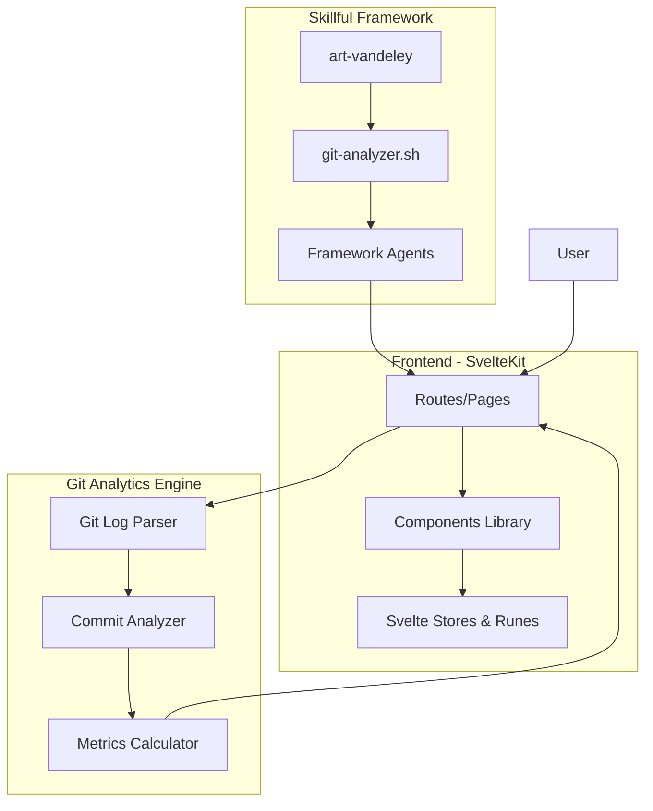
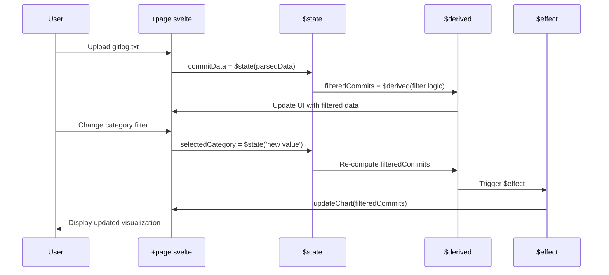

# Skillful Framework - Example Outputs

Real-world examples of documentation generated by skillful agents.

## Table of Contents

- [Svelte Examples](#svelte-examples)
  - [README.md Sample](#readmemd-sample-svelte)
  - [Mermaid Diagrams](#mermaid-diagrams-svelte)
- [Before/After Comparisons](#beforeafter-comparisons)

---

## Svelte Examples

### README.md Sample (Svelte)

Example output from `skillful-svelte` agent for a SvelteKit analytics dashboard:

```markdown
# Vandeley Analytics

[](https://svelte.dev)
[](https://kit.svelte.dev)

## 🎯 ¿Qué es Vandeley Analytics?

Vandeley es un framework de orquestación de agentes IA con lazy-loading que combina analíticas de git con carga bajo demanda de habilidades. El dashboard analiza patrones de commits, detecta deuda técnica y mide la salud arquitectural de proyectos.

El sistema utiliza **Svelte 5 con runes** para gestión de estado reactivo y SvelteKit para enrutamiento basado en archivos.

## ✨ Características Principales

- **Análisis de Commits** - Visualiza velocidad, hotspots y sesiones de trabajo
- **KPIs Arquitecturales** - Scoring de deuda técnica, preparación de escalado
- **Analíticas de Colaboración** - Patrones de contribución y distribución de conocimiento
- **Framework Skillful** - Sistema de agentes que se auto-cargan mediante curl

## 🚀 Inicio Rápido

### Requisitos Previos
- Node.js 18+
- Git (para analíticas)

### Instalación

\```bash
# Clonar el repositorio
git clone https://github.com/user/vandeley.git
cd vandeley

# Instalar dependencias
npm install

# Ejecutar servidor de desarrollo
npm run dev

# Abrir http://localhost:5173
\```

## 🏗️ Arquitectura

Vandeley implementa un patrón de **lazy-loading de agentes** donde agentes IA obtienen instrucciones mediante curl en tiempo real. El dashboard está construido con Svelte 5, utilizando runes para gestión de estado reactivo.

### Estructura del Proyecto

\```
src/
├── routes/
│   ├── analyze/          # Dashboard de analíticas git
│   │   ├── +page.svelte  # Página principal de análisis
│   │   └── components/   # Componentes del dashboard
│   ├── skills/           # Marketplace de skills
│   └── tools/            # Herramientas de desarrollo
├── lib/
│   ├── analytics/        # Motor de analíticas git
│   ├── parser/           # Parseo de git log
│   └── components/       # Componentes reutilizables
└── app.html              # Template HTML base
\```

## 🎨 Conceptos Clave de Svelte 5

Este proyecto utiliza las nuevas **runes de Svelte 5** para gestión de estado reactivo:

### Runes Utilizadas

**`$state()`** - Estado reactivo en componentes
\```javascript
let commitData = $state([]);
let selectedCategory = $state('all');
\```

**`$derived()`** - Valores computados automáticamente
\```javascript
const filteredCommits = $derived(
  selectedCategory === 'all'
    ? commitData
    : commitData.filter(c => c.category === selectedCategory)
);
\```

**`$effect()`** - Efectos secundarios que reaccionan a cambios
\```javascript
$effect(() => {
  console.log('Commits changed:', commitData.length);
  updateChart(filteredCommits);
});
\```

### Migración desde Svelte 4

Este proyecto migró de Svelte 4 a Svelte 5. Cambios principales:
- `let count = 0` → `let count = $state(0)`
- `$: doubled = count * 2` → `let doubled = $derived(count * 2)`
- `$: { ... }` → `$effect(() => { ... })`

## 📦 Dependencias Principales

- **SvelteKit 2** - Framework de aplicaciones full-stack
- **D3.js** - Visualizaciones de datos interactivas
- **Vite** - Build tool y dev server
- **Tailwind CSS** - Estilos utilitarios

## 🤝 Contribuir

Las contribuciones son bienvenidas. Por favor:

1. Fork el proyecto
2. Crea una rama para tu feature (`git checkout -b feature/nueva-funcionalidad`)
3. Commit tus cambios (`git commit -m 'Agregar nueva funcionalidad'`)
4. Push a la rama (`git push origin feature/nueva-funcionalidad`)
5. Abre un Pull Request

## 📄 Licencia

MIT

---

**Construido con Svelte 5, D3.js, y el poder de lazy-loading everything.**
```

---

### Mermaid Diagrams (Svelte)

#### system-architecture.mmd



#### component-hierarchy.mmd

```mermaid
graph TD
    App[+layout.svelte]
    App --> Home[/ - +page.svelte]
    App --> Analyze[/analyze - +page.svelte]
    App --> Skills[/skills - +page.svelte]
    App --> Tools[/tools - +page.svelte]

    Analyze --> Dashboard[Dashboard.svelte]
    Dashboard --> CommitChart[CommitChart.svelte]
    Dashboard --> HotspotMap[HotspotMap.svelte]
    Dashboard --> MetricsPanel[MetricsPanel.svelte]

    Skills --> SkillCard[SkillCard.svelte]
    SkillCard --> InstallButton[InstallButton.svelte]

    Tools --> DiagramGenerator[DiagramGenerator.svelte]

    style App fill:#FF3E00,color:#fff
    style Dashboard fill:#FF3E00,color:#fff
```

#### routing-diagram.mmd

```mermaid
graph LR
    Root["/"]
    Root --> Layout[+layout.svelte]

    Layout --> Index[/ - +page.svelte]
    Layout --> Analyze[/analyze/]
    Layout --> Skills[/skills/]
    Layout --> Tools[/tools/]

    Analyze --> AnalyzePage[+page.svelte]
    Analyze --> AnalyzeLoad[+page.js - load fn]

    Skills --> SkillsPage[+page.svelte]
    Skills --> SkillDetail[/skills/[id]/+page.svelte]

    Tools --> ToolsPage[+page.svelte]

    AnalyzeLoad -->|fetch data| AnalyzePage

    style Layout fill:#FF3E00,color:#fff
    style AnalyzeLoad fill:#4CAF50,color:#fff
```

#### state-flow.mmd



---

## Before/After Comparisons

### ❌ Before (Generic README)

```markdown
# My Svelte App

This is a web application built with Svelte.

## Installation

```
npm install
npm run dev
```

## Features

- Fast
- Reactive
- Modern

## License

MIT
```

**Problems:**
- No Spanish
- Zero specifics about what the app does
- No Svelte 5 runes explanation
- Generic features list
- No architecture diagrams
- Doesn't mention SvelteKit routing
- Can't tell what makes this app unique

---

### ✅ After (Skillful-Svelte Generated)

```markdown
# Vandeley Analytics

[](https://svelte.dev)

## 🎯 ¿Qué es Vandeley Analytics?

Vandeley es un framework de orquestación de agentes IA con lazy-loading que combina analíticas de git con carga bajo demanda de habilidades. El dashboard analiza patrones de commits, detecta deuda técnica y mide la salud arquitectural de proyectos.

## ✨ Características Principales

- **Análisis de Commits** - Visualiza velocidad, hotspots y sesiones de trabajo mediante D3.js
- **KPIs Arquitecturales** - Scoring automático de deuda técnica basado en git history
- **Framework Skillful** - Sistema de agentes que se auto-cargan mediante curl on-demand

## 🎨 Conceptos Clave de Svelte 5

Este proyecto utiliza las nuevas **runes de Svelte 5**:

**`$state()`** - Estado reactivo
\```javascript
let commitData = $state([]);
\```

**`$derived()`** - Valores computados
\```javascript
const filteredCommits = $derived(
  commitData.filter(c => c.category === selectedCategory)
);
\```

[... rest of comprehensive documentation ...]
```

**Improvements:**
- ✅ Complete Spanish documentation
- ✅ Specific project description
- ✅ Svelte 5 runes with actual code from the project
- ✅ Architecture diagrams included (4 Mermaid files)
- ✅ SvelteKit routing explained
- ✅ Concrete features with technical details
- ✅ Setup instructions that actually work

---

## Go Examples (Planned)

*Coming soon when `skillful-go` agent is implemented.*

Expected output:
- Spanish README with Go modules explanation
- Package diagram showing internal structure
- API routing diagram (if HTTP service)
- Concurrency patterns documentation (goroutines, channels)

---

## TypeScript Examples (Planned)

*Coming soon when `skillful-typescript` agent is implemented.*

Expected output:
- Spanish README with TypeScript configuration
- Module dependency diagram
- Type hierarchy visualization
- Build process documentation

---

## Quality Checklist

All examples should demonstrate:

- ✅ **Spanish language** - Neutral, professional, accessible
- ✅ **Framework-specific** - Not generic boilerplate
- ✅ **Real code examples** - From the actual project being documented
- ✅ **Accurate diagrams** - Mermaid files that match codebase structure
- ✅ **Working instructions** - Setup steps that succeed
- ✅ **Explains "why"** - Not just "what" but reasoning behind patterns

---

**Last updated**: 2025-10-25
**Available examples**: Svelte
**Planned examples**: Go, TypeScript
